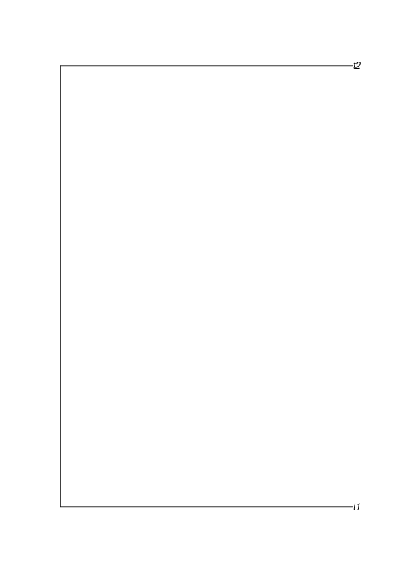
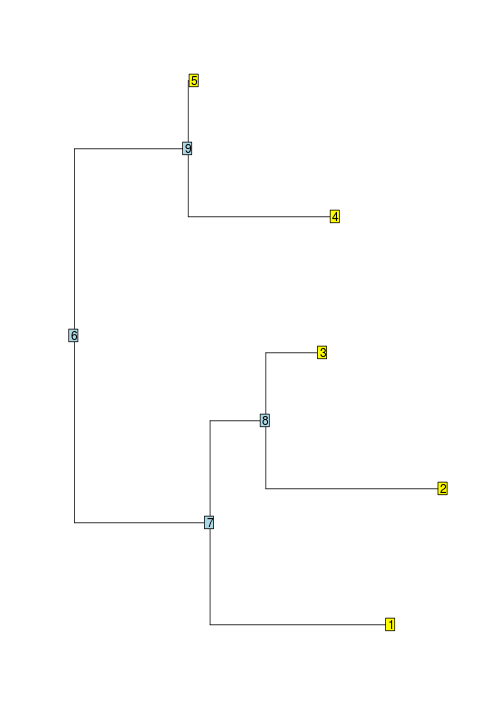
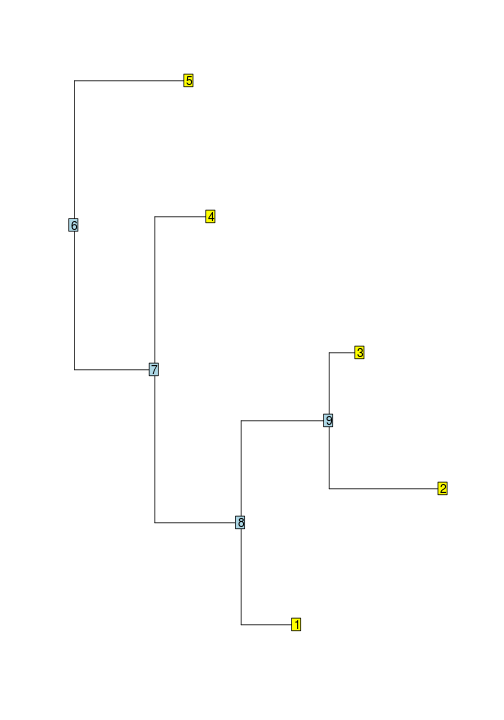
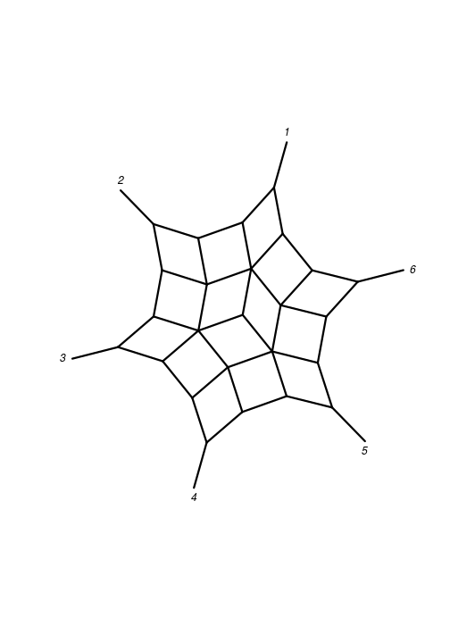

## The `phylo` class

The `phylo` class is a tree structure in `ape` are the standard for storing phylogenetic in R. It is also used in more than 100 packages on CRAN.  

An object of class `phylo` is a list containing at least the following objects:
  
1. An *integer* matrix named edge with two columns and as many rows as there are edges in the tree.
2. A *character* vector named `tip.label`.  
3. An *integer* `Nnode` with the number of internal nodes.
4. A class attribute `phylo`. 

The storage mode is important. Saving a vector of integers saves memory in comparison to vector of doubles. 
Also objects of class `phylo` often in C-Code so you need to take care of this. 

Also comparing doubles is dangerous:  

```r
x <- 3
x
```

```
## [1] 3
```

```r
y <- sqrt(3)^2
y
```

```
## [1] 3
```

```r
x==y
```

```
## [1] FALSE
```

In the edge matrix each edge (branch) is coded by the nodes it connects. Tips (terminal nodes, leaves, labels, ...) are numbered from 1 to `n`, where `n` is the number of tips. The root is numbered `n+1`. The ancestral node (closer to the root) is always on the lefthand column.    

Some important properties and observations:
* the first column only contains values greater than `n`.
* all nodes, s the root, appear exactly once in the second column. 
* in a strictly bifurcating tree, all nodes greater then `n` appear twice and the root node `n+1`, in case of 'twice' for rooted and `trice` for unrooted trees. 

So we can start and construct a minimal tree ourselves:

```r
library(ape)
simple_tree <- structure(list(edge = matrix(c(3L, 3L, 1L, 2L), 2, 2), tip.label = c("t1", "t2"), Nnode = 1L), class = "phylo")
plot(simple_tree)
```



A `phylo` object always contains an `edge`, `tip.label` and `Nnode`. Often a phylo object contains some of the following elements:

1. a *numeric* vector `edge.length`. The length of the vector is number of rows of the `edge` matrix and the order corresponds to the rows in `edge`. 
2. a *character* vector `node.labels` of length `Nnode`. The node labels are labeled from `n+1` to `n+Nnode`
3. A single *numeric* root.edge providing the edge length at the root.  

Additionally most `phylo` objects have an attribute `order`, which can be either "cladewise", "postorder" or "pruningwise". 


## Tree traversal

Tree traversal in ape is implemented iterative in contrast to the recursive implementation in most other phylogenetic programs. 
### Preorder tree traversal
*Preorder tree traversal* is travelling through the tree from the root to the tips visiting always the all nodes the right subtree before visiting the right subtree.  

```r
tree <- rtree(5)
plot(tree, show.tip.label = FALSE)
nodelabels()
tiplabels()
```



```r
reorder(tree, "cladewise")$edge
```

```
##      [,1] [,2]
## [1,]    6    7
## [2,]    7    1
## [3,]    7    8
## [4,]    8    2
## [5,]    8    3
## [6,]    6    9
## [7,]    9    4
## [8,]    9    5
```
### Postorder tree traversal 
*Postorder tree traversal* travels through the tree from the tips through the root. All the descendent nodes need to be visited before the ancestral node. 

```r
reorder(tree, "postorder")$edge
```

```
##      [,1] [,2]
## [1,]    9    4
## [2,]    9    5
## [3,]    8    2
## [4,]    8    3
## [5,]    7    1
## [6,]    7    8
## [7,]    6    7
## [8,]    6    9
```

Defining the order of the traversal of the tree this way allows to iterate just through the tree. Reorder not only changes the order of the `edge` matrix, but also of the `edge.length` if it exists. 


### Convenience functions
There are several convenience functions to achieve common tasks:

| Operation      | High level       | Low level      |
|--------------- | -----------------|----------------|  
| How many tips? | Ntip(tr) | length(tr\$tip.label) |
| How many node? | Nnode(tr)  | tr\$Nnode |
| How many edges? | Nedge(tr) | nrow(tr\$edge) |
| What are the ancestor of x | Ancestors(tr, x, "parent") | tr\$edge[tr\$edge[,2]==x , 1] |
| What are the descendants of x | Descendants(tr, x, "children") | tr\$edge[tr\$edge[,1]==x , 2] |


###Excercise 1:
Write a function which counts how many descendants each node has. 


My solutions


```r
library(phangorn)
nr_desc_cheat <- function(x){
  lengths(Descendants(x, 1:max(x$edge)))
} 


nr_desc <-  function(x){
    x <- reorder(x, "postorder")
    res <- numeric(max(x$edge))
    res[1:Ntip(x)] = 1L
    for(i in 1:nrow(x$edge)){
        tmp = x$edge[i,1]
        res[tmp] =  res[tmp] + res[x$edge[i,2] ]
    }
    res
}


set.seed(42)
tree <- rtree(5)

plot(tree, show.tip.label = FALSE)
nodelabels()
tiplabels()
```



```r
nr_desc_cheat(tree)
```

```
## [1] 1 1 1 1 1 5 4 3 2
```

```r
nr_desc(tree)
```

```
## [1] 1 1 1 1 1 5 4 3 2
```

###Excercise 2:
Write a function which computes the distance from each node to the root.


My solution:


```r
root_to_tip <-  function(x){
    x <- reorder(x)
    res <- numeric(max(x$edge))
    for(i in 1:nrow(x$edge)){
        pa <- x$edge[i,1]
        ch <- x$edge[i,2]        
        res[ch] =  res[pa] + x$edge.length[i]
    }
    res
}

tree$edge.length[] <- 1
root_to_tip(tree)
```

```
## [1] 3 4 4 2 1 0 1 2 3
```


## The 'multiPhylo' class

An object of class 'multiPhylo' is a list of of several trees each of class 'phylo'. 
If all trees share the same tip labels, as in bootstrap samples or from MCMC analyses, trees can be saved in a memory efficient way storing the labels only once in an attribute *TipLabel*. 
 

```r
trees <- rmtree(1000, 100)
trees
```

```
## 1000 phylogenetic trees
```

```r
attr(trees, "TipLabel")
```

```
## NULL
```

```r
object.size(trees)
```

```
## 9992256 bytes
```

```r
trees_compact <- .compressTipLabel(trees)
attr(trees_compact, "TipLabel")
```

```
##   [1] "t36"  "t64"  "t77"  "t55"  "t23"  "t9"   "t95"  "t29"  "t62"  "t1"  
##  [11] "t19"  "t84"  "t82"  "t99"  "t93"  "t44"  "t63"  "t52"  "t83"  "t18" 
##  [21] "t81"  "t31"  "t74"  "t75"  "t57"  "t97"  "t40"  "t91"  "t85"  "t60" 
##  [31] "t53"  "t32"  "t37"  "t68"  "t73"  "t24"  "t78"  "t70"  "t96"  "t26" 
##  [41] "t35"  "t71"  "t42"  "t92"  "t88"  "t89"  "t13"  "t39"  "t47"  "t79" 
##  [51] "t69"  "t46"  "t41"  "t28"  "t38"  "t6"   "t34"  "t27"  "t7"   "t4"  
##  [61] "t90"  "t51"  "t56"  "t98"  "t58"  "t72"  "t10"  "t5"   "t65"  "t11" 
##  [71] "t50"  "t12"  "t20"  "t21"  "t33"  "t66"  "t48"  "t16"  "t43"  "t86" 
##  [81] "t54"  "t30"  "t59"  "t87"  "t8"   "t61"  "t2"   "t3"   "t94"  "t15" 
##  [91] "t67"  "t80"  "t17"  "t25"  "t22"  "t49"  "t76"  "t45"  "t14"  "t100"
```

```r
object.size(trees_compact)
```

```
## 4302008 bytes
```

Switching between the two representations can be done via '.compressTipLabel' and '.uncompressTipLabel'. 

## networx class

The networx class is build up on `phylo` to allow to store (undirected) phylogenetic networx. I may will go into more detail later the week. 


```r
library(magrittr)
phangorn:::allCircularSplits(6) %>% as.networx %>% plot(type="2D")
```




## prop.part, prop.clades and splits

If we want to compare 2 trees we often are interested which edges they share. 


## phyDat

`phyDat` is the main data class in `phangorn` to store aligned discrete data. This can be binary, nucleotide, protein, codon, morphological of dicrete data. 
The data format is very similar to the internal forma of a `factor` variable in R.
The data are stored as vectors integers in a list with as many vectors as sequences. 

The phyDat format has the following attributes. 
*weight*


Paradis E. (2012) Definition of Formats for Coding Phylogenetic Trees in R [url](http://ape-package.ird.fr/misc/FormatTreeR_24Oct2012.pdf)

Paradis E. (2012) Analysis of Phylogenetics and Evolution with R, 2nd ed., Springer, New York 
 
Schliep K.P. 2011. phangorn: phylogenetic analysis in R. Bioinformatics, 27(4) 592-593